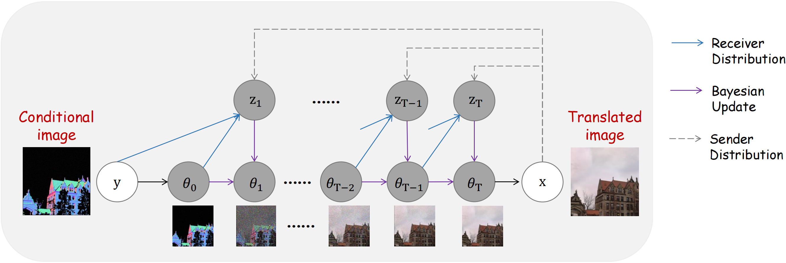
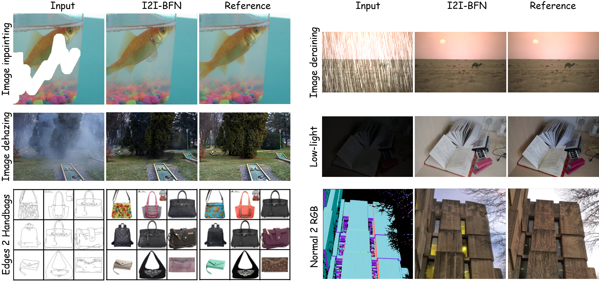

# I2I-BFN
Official PyTorch implementation of *Image-to-Image Bayesian Flow Networks with Structurally Informative Priors (I2I-BFN)*,  a novel framework for general-purpose image-to-image translation (I2I) that operates within the parameter space of distributions. Our method maintains Gaussian distributions over pixel values and adapts distribution parameters using closed-form Bayesian inference guided by network predictions of the translated image. An essential aspect of our approach is the utilization of the conditional image as a robust prior parameter, initializing the translation process from a deterministic, clean image to reduce variance and produce interpretable generation.

# Graphical models for I2I-BFNs.

    

    

Outputs of our proposed I2I-BFN for various image-to-image translation tasks. I2I-BFN is a general-purpose framework capable of producing high-quality and faithful generations across a variety of tasks.
